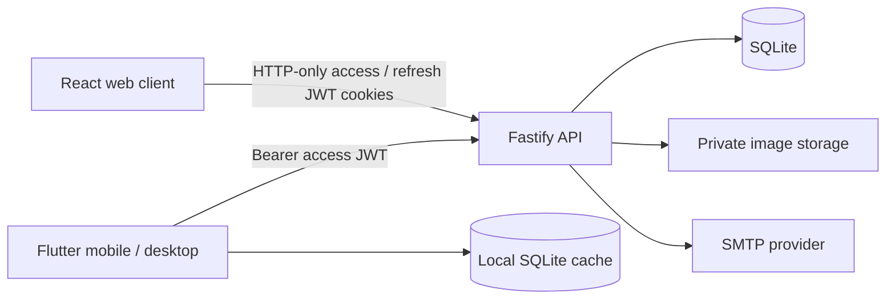

# Planner

Planner is a self-hosted, multi-user planning application for the web, mobile, and desktop. It combines a rolling calendar, flexible task cards, recurring habits, reminders, image attachments, offline-first native clients, and a privacy-conscious administration panel in one deployable project.

The project is designed for individuals, families, and small teams that want to keep their planning data on infrastructure they control.

## Highlights

- **Rolling calendar** — navigate a continuous date window instead of being constrained to calendar weeks.
- **Flexible cards** — add titles, notes, priorities, deadlines, tags, checklists with progress, colors, start/end times, completion state, reminders, and images.
- **Full-text search** — search every card title and note from web, mobile, or desktop, with an offline cache fallback in Flutter clients.
- **Flexible card filters** — narrow the board by status, priority, tags, source, deadline state, or color.
- **Drag and drop** — reorder cards within a day or move them across days on web, mobile, and desktop.
- **Mobile day navigation** — edge controls move one day at a time, keep the visible column synchronized with the day strip, and clearly highlight today.
- **Recurring habits** — generate independent cards for selected weekdays across a one-year planning window.
- **Multi-user isolation** — every query and uploaded file is scoped to its owner.
- **Invitation-based access** — administrators invite users; public registration is not exposed.
- **Email reminders** — schedule card reminders and daily summaries through any SMTP provider.
- **Offline-first native client** — Flutter keeps a local SQLite cache and replays queued writes when connectivity returns.
- **Responsive clients** — React powers the web UI; Flutter targets Android and Windows from a shared codebase.
- **Operational visibility** — structured logs, request IDs, health checks, OpenAPI documentation, and test coverage are built in.

## Architecture



All clients use the same versioned API under `/api/v1`. The production container serves both the API and the compiled web application.

### Technology stack

| Area | Technology |
|---|---|
| Web | React 19, Vite, TanStack Query, dnd-kit |
| API | Node.js 24, TypeScript, Fastify 5 |
| Primary storage | Node's built-in SQLite driver |
| Images | Sharp, private per-user file storage |
| Email | Nodemailer over SMTP |
| Mobile and desktop | Flutter, secure storage, local SQLite |
| API documentation | OpenAPI 3.0 and Swagger UI |
| Testing | Node test runner, Vitest, Testing Library, Flutter Test |
| Delivery | Docker, Docker Compose, GitHub Actions |

## Repository layout

```text
.
├── server/                  # Fastify API, persistence, scheduler, and migrations
│   ├── src/routes/          # Versioned HTTP endpoints
│   ├── src/migrations/      # SQLite schema migrations
│   └── test/                # Unit and HTTP contract tests
├── web/                     # React web application
│   └── src/                 # Pages, components, API client, and tests
├── mobile/                  # Flutter mobile and desktop application
│   ├── lib/                 # Shared Android/Windows application code
│   └── test/                # Unit, widget, offline, and interaction tests
├── data/                    # Runtime database and uploads; never commit this directory
├── Dockerfile
└── docker-compose.yml
```

## Requirements

For local web and API development:

- Node.js 24 or later
- npm 11 or later

For native development:

- Flutter stable with Dart 3.12 or later
- Android tooling for Android builds
- Visual Studio with Desktop development with C++ for Windows builds

Docker and Docker Compose are optional but recommended for production deployments.

## Quick start

Install the JavaScript dependencies:

```bash
npm install
```

Create your local configuration:

```bash
cp .env.example .env
```

On PowerShell:

```powershell
Copy-Item .env.example .env
```

Before the first start, replace at least these values in `.env`:

- `JWT_ACCESS_SECRET`
- `JWT_REFRESH_SECRET`
- `ADMIN_EMAIL`
- `ADMIN_PASSWORD`

Generate two independent signing secrets by running this command twice:

```bash
openssl rand -hex 32
```

Start the API and web development servers:

```bash
npm run dev
```

| Service | Local URL |
|---|---|
| Web application | `http://localhost:5173` |
| API | `http://localhost:3000/api/v1` |
| Swagger UI | `http://localhost:3000/documentation` |
| OpenAPI JSON | `http://localhost:3000/documentation/json` |

The first administrator is created from `ADMIN_EMAIL` and `ADMIN_PASSWORD`. These variables bootstrap the account only; changing them later does not change the stored password. Use the profile screen or `npm run sifre -- admin@example.com` to rotate an existing password.

## Configuration

Copy `.env.example` and keep the resulting `.env` file outside version control.

| Variable | Required | Description |
|---|---:|---|
| `NODE_ENV` | No | Runtime mode. Use `production` for deployments. |
| `API_PORT` | No | HTTP port. Defaults to `3000`. |
| `APP_URL` | Yes | Public origin used in invitation and password-reset links. |
| `DATA_DIR` | No | SQLite and upload directory. Defaults to `./data`. |
| `DEFAULT_TZ` | No | IANA timezone assigned to new users. |
| `DEFAULT_CARD_TIME` | No | Time used when calculating reminders for untimed cards. |
| `JWT_ACCESS_SECRET` | Yes | Secret used only to sign short-lived access JWTs. Minimum 32 characters. |
| `JWT_REFRESH_SECRET` | Yes | Separate secret used to sign rotating refresh JWTs. Minimum 32 characters. |
| `JWT_ISSUER` | No | Expected JWT issuer claim. Defaults to `planner-api`. |
| `JWT_AUDIENCE` | No | Expected JWT audience claim. Defaults to `planner-clients`. |
| `JWT_ACCESS_MINUTES` | No | Access-token lifetime. Defaults to `15` minutes. |
| `JWT_REFRESH_DAYS` | No | Refresh-session lifetime. Defaults to `30` days. |
| `ADMIN_EMAIL` | First run | Email address of the initial administrator. |
| `ADMIN_PASSWORD` | First run | Initial administrator passphrase; must contain 12–256 characters. |
| `ALLOWED_ORIGINS` | No | Comma-separated CORS origins for separately hosted clients. |
| `SMTP_HOST` | No | SMTP hostname. Email is disabled when SMTP settings are incomplete. |
| `SMTP_PORT` | No | SMTP port, commonly `465` or `587`. |
| `SMTP_SECURE` | No | `true` for implicit TLS, usually on port `465`. |
| `SMTP_USER` | No | SMTP account username. |
| `SMTP_PASS` | No | SMTP password or provider-issued application password. |
| `MAIL_FROM` | No | Sender identity, for example `Planner <no-reply@example.com>`. |
| `LOG_LEVEL` | No | Structured log level: `trace`, `debug`, `info`, `warn`, `error`, or `fatal`. |
| `SLOW_REQUEST_MS` | No | Requests slower than this threshold emit a warning. |
| `API_DOCS` | No | Enables Swagger UI. Keep it disabled on public production deployments unless required. |

Never commit `.env`, SMTP credentials, JWT signing secrets, production data, or database backups.

## Mobile and desktop development

Install Flutter dependencies:

```bash
cd mobile
flutter pub get
```

Run the Windows client:

```bash
flutter run -d windows
```

Run on a connected Android device or emulator:

```bash
flutter devices
flutter run -d <device-id> --dart-define=PLANNER_API_URL=http://10.0.2.2:3000
```

The API origin is fixed at build/run time and cannot be changed from the login screen. It defaults to `http://localhost:3000` for desktop development. Supply `PLANNER_API_URL` with `--dart-define` for Android or production builds. Android emulators normally reach the host through `http://10.0.2.2:3000`; physical devices need a reachable LAN address or public HTTPS origin.

### Offline synchronization

The Flutter client stores cards in a local SQLite database and synchronizes through `GET /api/v1/changes?since=<timestamp>`. Offline mutations are queued and replayed in order after connectivity returns. Deletions are propagated as tombstones, and stale writes receive the current server record with HTTP `409`.

Checklist items are part of the card aggregate, so edits are saved atomically and follow the same offline queue and delta-sync flow as the rest of the card.

The native client stores short-lived access and rotating refresh JWTs through `flutter_secure_storage`. After an access token expires, the client rotates the refresh token, persists the replacement pair, and retries the original request once. The web client follows the same rotation flow while keeping both JWTs in JavaScript-inaccessible HTTP-only cookies.

## API documentation

Swagger UI is enabled by default in the development example configuration:

```text
http://localhost:3000/documentation
```

The generated OpenAPI document includes endpoint groups, request schemas, path/query parameters, and both supported authentication methods. The HTTP contract is also checked by the server test suite.

Important native-client endpoints include:

- `POST /api/v1/auth/token` — creates a native access/refresh JWT pair.
- `POST /api/v1/auth/refresh` — rotates a refresh JWT and issues a replacement pair.
- `GET /api/v1/changes` — returns delta synchronization data and deletion tombstones.
- `POST /api/v1/cards` — accepts client-generated UUIDs for offline creation.

## Email delivery

Planner works without SMTP, but invitations and password-reset links must then be copied manually from the UI. To enable email, provide all SMTP variables.

Example for a provider using STARTTLS:

```dotenv
SMTP_HOST=smtp.example.com
SMTP_PORT=587
SMTP_SECURE=false
SMTP_USER=planner@example.com
SMTP_PASS=replace-with-an-app-password
MAIL_FROM=Planner <no-reply@example.com>
```

Use an application password or dedicated SMTP credential instead of a personal account password. After configuration, send a test message from the application settings.

## Quality and testing

Run the complete cross-platform suite:

```bash
npm test
```

Available commands:

| Command | Purpose |
|---|---|
| `npm run test:server` | Server unit and HTTP contract tests |
| `npm run test:web` | React and browser-client tests |
| `npm run test:mobile` | Flutter unit and widget tests for mobile/desktop |
| `npm run test:coverage` | Coverage reports for all platforms |
| `npm run typecheck` | TypeScript checks and Flutter analysis |
| `npm run build` | Production web build |
| `npm run quality` | Static analysis, all tests, and production web build |

Live API smoke tests are skipped unless these variables are provided to the Flutter test process:

```text
PLANNER_URL
PLANNER_EMAIL
PLANNER_PASSWORD
```

GitHub Actions runs server/web checks and Flutter checks in separate jobs for every pull request and push to `main`.

## Observability and health checks

The server emits structured JSON logs. Sensitive headers, cookies, passwords, and tokens are redacted. Every request receives an `x-request-id`, and web/native clients include the same identifier in their error records. Requests exceeding `SLOW_REQUEST_MS` are logged separately.

The Flutter logger exposes a provider-neutral sink that can later forward records to a hosted error-monitoring service without coupling application code to one vendor.

| Endpoint | Purpose |
|---|---|
| `GET /api/v1/health` | General health response |
| `GET /api/v1/health/live` | Process liveness |
| `GET /api/v1/health/ready` | Readiness including SQLite access |

## Production deployment

Create a production `.env`, set `NODE_ENV=production`, use a public HTTPS `APP_URL`, rotate all example secrets, and disable API documentation unless it is intentionally exposed.

The JWT session migration intentionally invalidates legacy opaque sessions. Existing users must sign in again once after upgrading.
`COOKIE_SECRET` is no longer read. Replace it with two independently generated values for `JWT_ACCESS_SECRET` and `JWT_REFRESH_SECRET`; do not reuse the former cookie secret for both keys.

Build and start the container:

```bash
docker compose up -d --build
```

The Compose configuration binds the service to `127.0.0.1:3000`. Put a TLS-terminating reverse proxy in front of it.
The container runs as the unprivileged `node` user. On a native Linux host, ensure the bind-mounted `data/` directory is writable by UID/GID `1000` before startup.

### Caddy

```caddyfile
planner.example.com {
    reverse_proxy 127.0.0.1:3000
}
```

### Nginx

```nginx
location / {
    proxy_pass http://127.0.0.1:3000;
    proxy_set_header Host $host;
    proxy_set_header X-Forwarded-Host $host;
    proxy_set_header X-Forwarded-Proto $scheme;
    proxy_set_header X-Request-ID $request_id;
    client_max_body_size 25m;
}
```

Verify the deployment:

```bash
docker compose ps
curl --fail https://planner.example.com/api/v1/health/ready
```

## Data and backups

All persistent server state lives under `DATA_DIR`:

```text
data/
├── planner.db
├── planner.db-wal
├── planner.db-shm
└── uploads/
```

Back up the database and uploads together while the service is stopped:

```bash
docker compose stop planner
tar -czf planner-backup-$(date +%F).tar.gz data/
docker compose start planner
```

Store backups outside the application host and periodically test restoration. SQLite makes this deployment intentionally simple and is best suited to a single application instance. Do not run multiple replicas against the same database file.

## Security model

- Passwords are derived with `scrypt` and unique random salts.
- Access and refresh JWTs use separate HS256 signing secrets with fixed issuer, audience, algorithm, and expiry validation.
- Access JWTs are short-lived; refresh JWTs rotate on every use without extending the session's absolute expiry.
- Only refresh-token hashes and revocable session identifiers are stored in SQLite.
- Reuse of a recently rotated refresh token revokes the complete session.
- Web JWTs use `HttpOnly`, `SameSite=Strict`, and production-only `Secure` cookies; native JWTs use secure platform storage.
- Cookie-authenticated mutations require a trusted Origin, adding explicit CSRF protection.
- Authentication endpoints are rate-limited.
- User-owned records are scoped by `user_id` in the repository layer.
- Uploaded images are stored per user and served only after authorization and ownership checks.
- Administrative statistics do not expose card titles, notes, or image contents.
- Password changes invalidate existing sessions.
- Security headers are applied globally through Helmet, including a restrictive Content Security Policy.
- Production startup rejects short, placeholder, identical, or missing JWT secrets and non-HTTPS public URLs.

## Troubleshooting

### The mobile client cannot reach the server

Confirm that the API listens on an address reachable from the device, the firewall permits the port, and the client uses a LAN or HTTPS URL instead of `localhost`.

### Email is disabled

All SMTP values and `MAIL_FROM` must be present. Check the structured server logs and use the in-app test-email action.

### The initial admin password did not change

`ADMIN_PASSWORD` is only used when creating the first account. Run:

```bash
npm run sifre -- admin@example.com
```

### Swagger is not available in production

This is the secure default. Set `API_DOCS=true` only when the documentation should be reachable in that environment.
